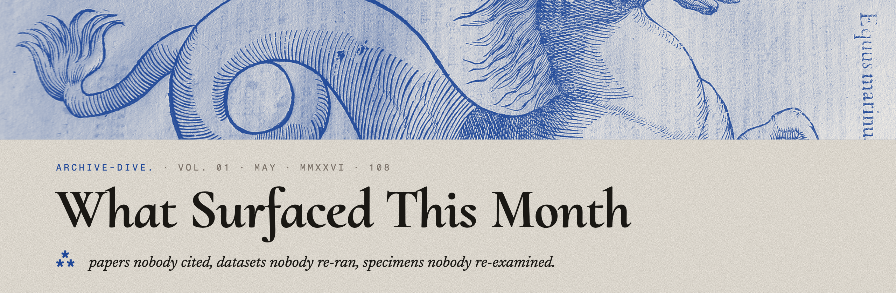

  

[Opener — what kind of month it was. What you were looking for, or what kept finding *you*. Two or three paragraphs. Set the tone.]

⁂

[Optional second paragraph in the opener. Why archive-dive matters. What you're hunting in the old papers / collections / datasets. The premise of the column.]

  

### ⁂ FINDS

**01 ·  [Title of the first find]**

[2–4 sentences. Where you found it (which archive, which year, which obscure book or dataset). What it actually is. Why it matters — what nobody noticed, or what it implies, or what could be done with it now. Link to the source if it's online.]

> *[Optional pull-quote if there's a great line from the original.]*

⁂

**02 ·  [Title of the second find]**

[Same structure. 2–4 sentences. Where, what, why.]

⁂

**03 ·  [Title of the third find]**

[Same.]

⁂

**04 ·  [Title of the fourth find — optional, drop if there are only three]**

[Same.]

⁂

[Optional closer — a paragraph tying the month's finds together, or a question that emerged across them, or what comes next month.]

  

kearney108 · archive-dive · vol·01 · MAY · 2026 · 108
